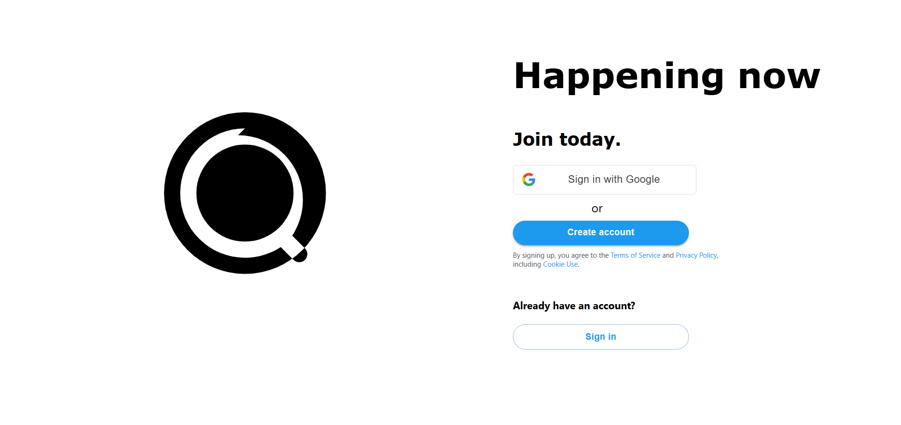
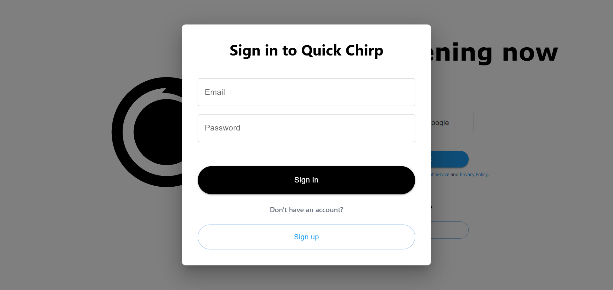
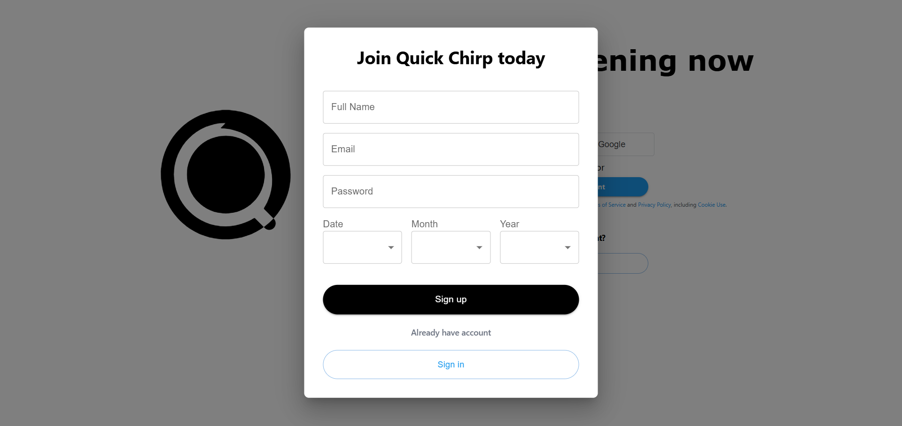
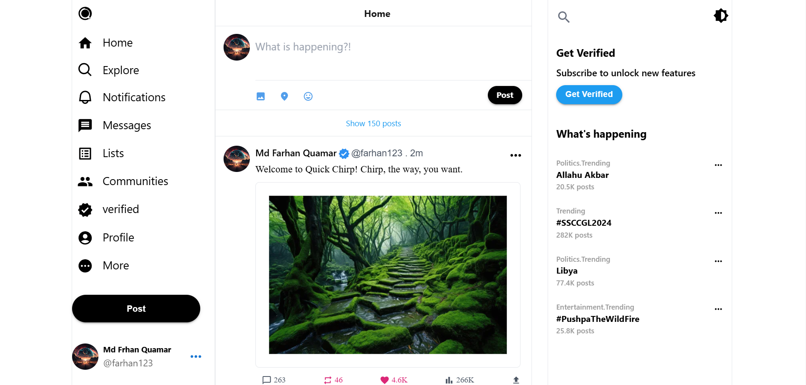

# Twitter Clone - Full Stack Project

## Overview
This project is a **Twitter Clone**, designed as a full-stack application using **React** for the frontend and **Spring Boot** for the backend. It replicates core functionalities of Twitter, allowing users to create accounts, post tweets, follow other users, and view a real-time feed. This project demonstrates scalable, modern web development practices and serves as a comprehensive showcase of full-stack development skills.

## Features
- **User Authentication**: Secure user registration and login using JWT authentication.
- **Tweet Management**: Create, edit, delete, and view tweets.
- **Follow System**: Follow and unfollow users to personalize your feed.

## Tech Stack
### Frontend
- **React**: For building a dynamic and responsive user interface.
- **Redux**: For state management.
- **Axios**: For API communication.
- **Tailwind CSS**: For modern and responsive styling.
- **Google OAuth Integeration**: For modern login ease.

### Backend
- **Spring Boot**: For creating a robust and scalable REST API.
- **Spring Security 6**: For authentication and authorization.
- **MySQL**: As the relational database for persistent data storage.

## System Architecture
The project follows a **3-tier architecture**:
1. **Frontend**: Handles user interaction and communicates with the backend via REST APIs.
2. **Backend**: Processes business logic and provides API endpoints.
3. **Database**: Stores user information, tweets, and follower data.

## Installation and Setup
### Prerequisites
- Node.js
- Java JDK
- MySQL

### Steps to Run
#### Backend (Spring Boot)
1. Clone the repository.
2. Navigate to the backend folder **server**.
3. Update the `application.properties` file with your MySQL credentials.
4. Run the following commands:
   ```bash
   mvn clean install
   mvn spring-boot:run
   ```

#### Frontend (React)
1. Navigate to the frontend folder **client**.
2. Install dependencies:
   ```bash
   npm install
   ```
3. Start the development server:
   ```bash
   npm start
   ```

#### Access the Application
- Open your browser and navigate to `http://localhost:3000`.

## Screenshots

1. Authentication Page



2. Sign in Modal



3. Sign up Modal



4. Home Page



5. Tweet Reply Modal


6. Subscription Modal


7. Profile Page


8. Edit Profile Modal


## Contact
- **Email**: farhanquamar2021@gmail.com